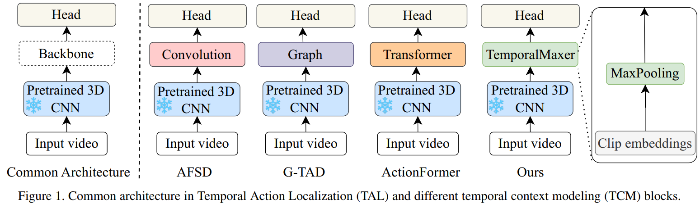

## TemporalMaxer: Maximize Temporal Context with only Max Pooling for Temporal Action Localization
This is the official implementation of the paper [TemporalMaxer](https://arxiv.org/pdf/2303.09055.pdf). 

We release the training and testing code for THUMOS, EPIC-Kitchen 100 (verb, noun), and MultiTHUMOS datasets.

## Operating Systems and Specs
* Ubuntu 18.04.5 LTS
* NVIDIA RTX A6000 
* NVIDIA-SMI 520.61.05 - Driver Version: 520.61.05 - CUDA Version: 11.8

## Table of Contents
1. [Introduction](#introduction)
2. [Installation](#installation)
3. [Usage](#usage)
6. [Citation](#citation)

## Introduction
Recent studies have emphasized the importance of applying long-term temporal context modeling (TCM) blocks to the extracted video clip features such as employing complex self-attention mechanisms. In this paper, we present the simplest method ever to address this task and argue that the extracted video clip features are already informative to achieve outstanding performance without sophisticated architectures. To this end, we introduce TemporalMaxer, which minimizes long-term temporal context modeling while maximizing information from the extracted video clip features with a basic, parameter-free, and local region operating max-pooling block. Picking out only the most critical information for adjacent and local clip embeddings, this block results in a more efficient TAL model. We demonstrate that TemporalMaxer outperforms other state-of-the-art methods that utilize long-term TCM such as self-attention on various TAL datasets while requiring significantly fewer parameters and computational resources.
<div align="center">
  
</div>
Our method, TemporalMaxer, results in the simplest model ever for TAL task that contains minimalist parameters and computational cost for the TAL model. TemporalMaxer is effective at modeling temporal contexts, which outperforms the robust baseline, ActionFormer, with 2.8x fewer GMACs and 3x faster inference speed. Especially, when comparing only the backbone time, our proposed method only takes 2.5 ms which is incredibly 8.0x faster than ActionFormer backbone, 20.1 ms.

## Installation
#### a. Install packages
```bash
conda create -n TemporalMaxer python=3.9
conda activate TemporalMaxer
conda install pytorch==1.12.1 torchvision==0.13.1 torchaudio==0.12.1 cudatoolkit=11.3 -c pytorch -y
python -m pip install -r requirements.txt
pip install -e ./
```
#### b. Build NMS
Part of NMS is implemented in C++. The code can be compiled by

```shell
cd ./libs/utils; python setup.py install; cd ../..
```
The code should be recompiled every time you update PyTorch.

## Usage
### Reproduce Our Results on EPIC-Kitchens 100
##### Download Features and Annotations
- Download epic_kitchens.tar.gz from this [link](https://1drv.ms/u/s!AmoaChPnSuIOmwPfVx8f4wQYluKM?e=WyuEBZ), md5sum `6cbf312eb5025c0abbbf5d0eaa61e556`.
- Make `data` folder in the current code directory.
- The data folder structure should look like the following:
```bash
# This folder
├── configs
│   ├── temporalmaxer_epic_slowfast_noun.yaml
│   └── temporalmaxer_epic_slowfast_verb.yaml
│   └── ........
├── data 
│   ├── epic_kitchens
│       ├── annotations
│       └── features
├── eval.py
├── figures
├── libs
    ........
```
- Train and test EPIC-Kitchens 100 `VERB`
```bash
# training
./scripts/epic_verb/train.sh
# testing
./scripts/epic_verb/test.sh
```

- Train and test EPIC-Kitchens 100 `NOUN`
```bash
# training
./scripts/epic_noun/train.sh
# testing
./scripts/epic_noun/test.sh
```

* The results should be:

| Method               |  0.1  |  0.2  |  0.3  |  0.4  |  0.5  |  Avg  |
|----------------------|-------|-------|-------|-------|-------|-------|
| TemporalMaxer (verb) | 27.8  | 26.6  | 25.3  | 23.1  | 19.9  | 24.5  |
| TemporalMaxer (noun) | 26.3  | 25.2  | 23.5  | 21.3  | 17.6  | 22.8  |


### Reproduce Our Results on THUMOS
##### Download Features and Annotations
- Download thumos.tar.gz from this [link](https://1drv.ms/u/s!AmoaChPnSuIOmwImo2-7iaRzrrAT?e=lyebbA), md5sum `1f71c37dba55d549e4b02841d0dcf603`.
- Make `data` folder in the current code directory.
- The data folder structure should look like the following:
```bash
# This folder
├── configs
│   └── ........
│   └── temporalmaxer_thumos_i3d.yaml
├── data
│   ├── thumos
│       ├── annotations
│       └── i3d_features
├── eval.py
├── figures
├── libs
    ........
```
- Train and test THUMOS
```bash
# training
./scripts/thumos/train.sh
# testing
./scripts/thumos/test.sh
```
* The results should be:

| Method            |  0.3  |  0.4  |  0.5  |  0.6  |  0.7  |  Avg  |
|-------------------|-------|-------|-------|-------|-------|-------|
| TemporalMaxer     | 82.8  | 78.9  | 71.8  | 60.5  | 44.7  | 67.7  |


### Reproduce Our Results on MultiTHUMOS
##### Download Features and Annotations
- Download multithumos.tar.gz from this [link](https://1drv.ms/u/s!AmoaChPnSuIOmwHEH3WTAfaSkBfq?e=jXaApc), md5sum `5b2477678abd612440b6099e349442ad`.
- Make `data` folder in the current code directory.
- The data folder structure should look like the following:

```bash
# This folder
├── configs
│   └── ........
│   └── temporalmaxer_multithumos_i3d.yaml
│   └── ........
├── data
│   ├── thumos
│   │   ├── annotations
│   │   └── i3d_features
│   ├── multithumos
│       ├── ........
│       └── multithumos.json
│       └── ........
├── eval.py
├── figures
├── libs
    ........
```
- Train and test MultiTHUMOS
```bash
# training
./scripts/multithumos/train.sh
# testing
./scripts/multithumos/test.sh
```
* The results should be:

| Method            |  0.1  |  0.2  |  0.3  |  0.4  |  0.5  |  0.6  |  0.7  |  0.8  |  0.9  |  Avg  |
|-------------------|-------|-------|-------|-------|-------|-------|-------|-------|-------|-------|
| TemporalMaxer     | 49.1  | 47.5  | 44.3  | 39.4  | 33.4  | 26.5  | 17.4  | 9.1   | 2.24  | 29.9  |

## Citation
Please cite the paper in your publications if it helps your research:
```
@article{tang2023temporalmaxer,
  title={TemporalMaxer: Maximize Temporal Context with only Max Pooling for Temporal Action Localization},
  author={Tang, Tuan N and Kim, Kwonyoung and Sohn, Kwanghoon},
  journal={arXiv preprint arXiv:2303.09055},
  year={2023}
}
```
